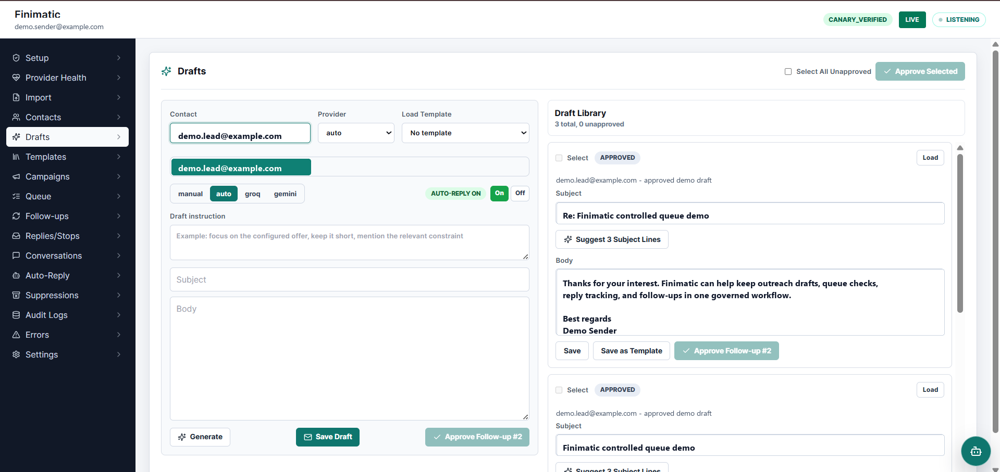
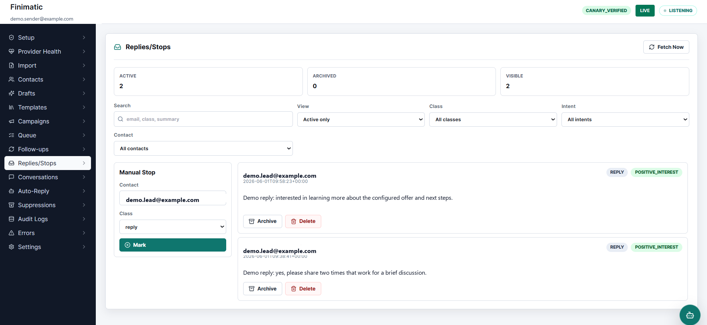
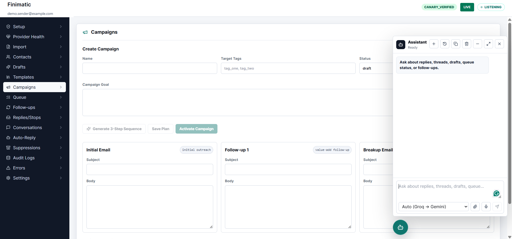
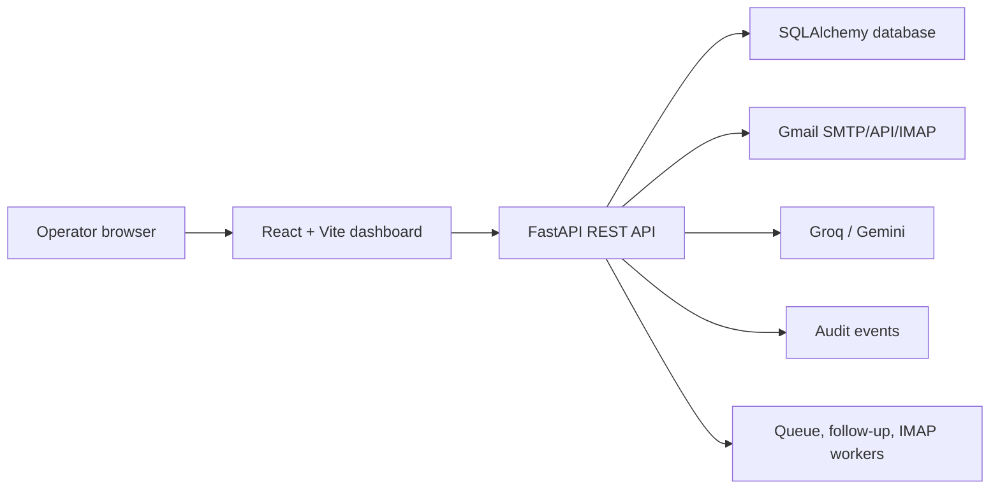

# Finimatic

[](https://github.com/RossDmello2/email-automation/actions/workflows/ci.yml)
[](https://fastapi.tiangolo.com/)
[](https://vitejs.dev/)
[](https://www.sqlalchemy.org/)
[](LICENSE)

Finimatic is a local-first, human-in-the-loop cold email automation dashboard built with FastAPI, React, Vite, SQLAlchemy, Gmail SMTP/IMAP, Groq, and Gemini. It helps an operator import leads, draft outreach, approve messages, process a policy-gated send queue, track replies, schedule follow-ups, and audit every email operation.

The project is for developers, technical operators, and maintainers who want to study or self-host a governed email operations workflow. AI can help draft and summarize, but backend code owns credentials, policy checks, audit logs, confirmation gates, and send execution.

> Public deployment warning: this repository does not include authentication. Run it locally, put it behind private access, or add auth before exposing the backend with real Gmail or provider credentials.

## Preview

The banner is generated conceptual artwork for README presentation. The product screenshots below it are real sanitized captures from the running app.








## What It Does

- Imports contacts from manual entry, pasted text, CSV, or TXT.
- Stores Gmail, Groq, and Gemini credentials through backend Settings with Fernet encryption.
- Generates outreach drafts through Groq, Gemini, or manual workflows.
- Keeps drafts unapproved until the operator reviews and approves them.
- Queues approved messages and evaluates send policy before dispatch.
- Supports dry-run, canary, SMTP, Gmail API, and fake transport modes.
- Tracks replies through manual entry and Gmail IMAP fetch.
- Stops follow-ups for replies, unsubscribes, bounces, suppressions, pauses, and other stop states.
- Provides conversation threads and context-aware reply generation.
- Includes a floating assistant for bounded campaign questions, draft generation, and confirmation-bound sends.
- Writes audit events for settings, imports, drafts, queue decisions, sends, replies, follow-ups, and assistant actions.

## What It Does Not Do Yet

- It is not a hosted SaaS product by itself.
- It does not include user login, teams, roles, or multi-tenant access control.
- It does not guarantee production email deliverability, inbox placement, or campaign compliance.
- It does not make AI authoritative for side effects.
- It does not store provider secrets in frontend environment variables.

## Safety Model

Finimatic is designed around explicit operator control:

```text
Lead data -> Draft suggestion -> Human review -> Approval -> Policy gates -> Send -> Audit -> Follow-up/reply state
```

Assistant-driven sends add a second confirmation harness:

```text
User message -> Intent/slots -> Redacted evidence -> Draft -> Pending action -> Confirm -> Hash/session/expiry checks -> Send -> Audit
```

Important boundaries:

- The browser never receives Gmail app passwords, Groq keys, Gemini keys, or Fernet secrets.
- `VITE_API_URL` is the only frontend environment variable.
- Gmail/Groq/Gemini credentials are configured in the app Settings screen and encrypted in backend storage.
- AI output is treated as a proposal, not as authority.
- Email sending requires backend policy checks.
- Assistant sends require a valid, unexpired, unconsumed pending action that still matches the draft hash.
- Raw credentials and full private inbox data should never appear in screenshots, docs, API responses, prompts, logs, or audit payloads.

## Tech Stack

| Area | Stack |
| --- | --- |
| Backend | Python, FastAPI, SQLAlchemy, Pydantic, APScheduler |
| Frontend | React 18, TypeScript, Vite, TanStack Query, React Router, lucide-react, sonner |
| Database | SQLite for local development, PostgreSQL-capable SQLAlchemy URL for production |
| Email | Gmail SMTP, Gmail API transport, Gmail IMAP, fake transport for tests |
| AI | Groq and Gemini configured through Settings |
| Tests | pytest, FastAPI TestClient, TypeScript, Vite build |
| Deployment Configs | Render backend, Vercel/Netlify frontend, optional GitHub Pages frontend workflow |

## Architecture



The frontend is an operator interface. The backend is the authority for credentials, data access, model calls, policy gates, side effects, and audit records.

Read more:

- [Architecture](docs/ARCHITECTURE.md)
- [API Reference](docs/API_REFERENCE.md)
- [Current Data Model](docs/DATA_MODEL.md)
- [Deployment Guide](docs/DEPLOYMENT.md)

## Repository Layout

```text
.
|-- backend/
|   |-- app/
|   |   |-- agent/              # Governed floating assistant backend
|   |   |-- ai/                 # Groq/Gemini gateway and provider helpers
|   |   |-- audit/              # Redacted audit event API
|   |   |-- contacts/           # Contact CRUD and lifecycle state
|   |   |-- conversations/      # Conversation threads and reply sends
|   |   |-- db/                 # SQLAlchemy models, sessions, migrations
|   |   |-- drafts/             # Manual and AI draft workflows
|   |   |-- followups/          # Follow-up scheduling and stop checks
|   |   |-- imports/            # Lead import preview and commit
|   |   |-- replies/            # Manual/IMAP reply lifecycle
|   |   |-- send/               # SMTP/API adapter, queue worker, policy gates
|   |   |-- settings/           # Encrypted settings and sender verification
|   |   `-- main.py             # FastAPI app and router mounts
|   |-- tests/
|   `-- sample.env.example
|-- frontend/
|   |-- src/
|   |   |-- api/client.ts
|   |   |-- features/floating-assistant/
|   |   `-- App.tsx
|   |-- package.json
|   `-- .env.example
|-- docs/
|   |-- assets/
|   |-- API_REFERENCE.md
|   |-- ARCHITECTURE.md
|   |-- DATA_MODEL.md
|   |-- DEPLOYMENT.md
|   |-- GETTING_STARTED.md
|   |-- TESTING.md
|   |-- TROUBLESHOOTING.md
|   `-- reference/              # Historical specs, audits, and repair notes
|-- .github/
|-- render.yaml
|-- vercel.json
`-- netlify.toml
```

## Prerequisites

- Python 3.11 or newer
- Node.js 20 or newer
- npm
- A Gmail account with an app password or Gmail API OAuth credentials if you want real email behavior
- Optional Groq and Gemini API keys for AI-assisted drafting

Manual drafting and fake transport tests can run without AI keys.

## Quick Start

Clone the repository:

```bash
git clone https://github.com/RossDmello2/email-automation.git
cd email-automation
```

Set up the backend:

```bash
cd backend
python -m venv .venv
```

Activate the virtual environment.

Windows PowerShell:

```powershell
.\.venv\Scripts\Activate.ps1
```

macOS/Linux:

```bash
source .venv/bin/activate
```

Install backend dependencies:

```bash
python -m pip install --upgrade pip
pip install -r requirements.txt
```

Create backend environment file:

```bash
cp sample.env.example .env
```

Generate a Fernet key and put it in `backend/.env`:

```bash
python -c "from cryptography.fernet import Fernet; print(Fernet.generate_key().decode())"
```

Start the backend:

```bash
python -m uvicorn app.main:app --reload --host 127.0.0.1 --port 8000
```

In a second terminal, set up the frontend:

```bash
cd frontend
npm install
cp .env.example .env
npm run dev
```

Open the app:

[http://localhost:5173](http://localhost:5173)

Check the backend health endpoint:

[http://localhost:8000/api/health](http://localhost:8000/api/health)

Expected response:

```json
{"status":"ok"}
```

## First Safe Workflow

Start with dry-run and fake or disposable data:

1. Open the dashboard.
2. Confirm the app is in dry-run mode.
3. Create a manual test contact.
4. Write a manual draft.
5. Approve the draft.
6. Process the queue.
7. Review Audit Logs.
8. Add a manual reply.
9. Open Conversations.
10. Ask the floating assistant: `who replied today?`

Move to real Gmail only after you understand dry-run, canary verification, suppressions, caps, and audit logs.

## Real Gmail Setup

In Settings, configure only disposable or intended sender credentials:

1. Gmail sender email.
2. Email transport: Gmail SMTP or Gmail API.
3. Gmail app password for SMTP/IMAP, or Gmail API OAuth values for Gmail API transport.
4. Report recipient.
5. Optional Groq and Gemini keys.
6. Save settings.
7. Verify email.
8. Send a canary email before live sends.

Do not commit credentials, `.env`, local databases, inbox screenshots, or private logs.

## Common Commands

Backend:

```bash
cd backend
python -m pytest -q
python -m uvicorn app.main:app --reload --host 127.0.0.1 --port 8000
```

Frontend:

```bash
cd frontend
npm install
npm run dev
npm run build
npm run preview
```

There is no frontend lint script in `frontend/package.json`; CI currently runs backend tests and the frontend production build.

## Configuration

Backend variables:

| Variable | Required | Purpose |
| --- | --- | --- |
| `FERNET_KEY` | Yes | Encrypts stored Gmail/Groq/Gemini secrets. Keep stable for an existing database. |
| `DATABASE_URL` | No | Defaults to `sqlite:///./finimatic.db`. Use durable storage in production. |
| `ALLOWED_ORIGINS` | No | Comma-separated CORS allow-list. |
| `PORT` | No | Runtime port used by some hosts. |
| `FINIMATIC_DISABLE_SCHEDULER` | No | Set to `1` for tests or diagnostics to stop background workers. |
| `FINIMATIC_TRANSPORT` | No | Set to `fake` for fake email transport in tests. |
| `FINIMATIC_FAKE_AI` | No | Set to `1` for deterministic fake AI in tests. |
| `GROQ_MODEL_FAST` | No | Optional model override used by reply classification paths. |
| `GROQ_TIMEOUT_S` | No | Optional Groq timeout override. |

Frontend variables:

| Variable | Required | Purpose |
| --- | --- | --- |
| `VITE_API_URL` | Yes in production | Backend API base URL, for example `https://your-api.onrender.com`. |

Do not add Gmail, Groq, Gemini, SMTP, IMAP, or Fernet secrets to frontend environment variables.

## API Overview

The backend exposes REST APIs under `/api` for health, settings, provider health, canary sends, imports, contacts, drafts, templates, campaigns, queue, follow-ups, suppressions, replies, conversations, auto-reply review, audit events, and assistant chat/confirm/cancel.

See [docs/API_REFERENCE.md](docs/API_REFERENCE.md) for route tables and safe local examples.

## Database

Local development uses SQLite by default. Current SQLAlchemy models live in `backend/app/db/models.py`; current public documentation is in [docs/DATA_MODEL.md](docs/DATA_MODEL.md). Historical schema and implementation notes are kept under [docs/reference/](docs/reference/).

For production, use durable storage. The backend requirements include `psycopg[binary]` for PostgreSQL-backed deployments.

## Deployment

The common split deployment is:

- Render for the FastAPI backend.
- Vercel, Netlify, or GitHub Pages for the Vite frontend.
- A persistent database for production data.

Read [docs/DEPLOYMENT.md](docs/DEPLOYMENT.md) before deploying. It covers environment variables, CORS, scheduler behavior, frontend build output, and production caveats.

## Documentation

- [Getting Started](docs/GETTING_STARTED.md)
- [Architecture](docs/ARCHITECTURE.md)
- [API Reference](docs/API_REFERENCE.md)
- [Current Data Model](docs/DATA_MODEL.md)
- [Deployment Guide](docs/DEPLOYMENT.md)
- [Testing Guide](docs/TESTING.md)
- [Troubleshooting](docs/TROUBLESHOOTING.md)
- [Historical Reference Docs](docs/reference/)

## Security Notes

- Never commit `.env`, `KEYS.md`, local databases, logs, or screenshots containing secrets.
- Use the Settings UI for Gmail/Groq/Gemini credentials.
- Keep `FERNET_KEY` stable for an existing database; changing it makes encrypted settings unreadable.
- Do not expose this dashboard publicly without authentication or private access.
- Treat live email sending as a side-effecting operation. Test fake, dry-run, and canary flows first.

See [SECURITY.md](SECURITY.md) for reporting and operational guidance.

## Contributing

Contributions are welcome. Start with [CONTRIBUTING.md](CONTRIBUTING.md), run the backend tests and frontend build, and keep all secret-handling and send-confirmation rules intact.

## Current Status

READY WITH GAPS.

This repository contains a working local-first email operations app with backend tests and a production-buildable frontend. It is not a complete hosted SaaS template out of the box.

Known gaps and deployment considerations:

- Authentication is not included.
- Live email, Gmail API, Groq, and Gemini verification require owner-provided credentials and should use disposable accounts first.
- SQLite is fine for local development, but production should use durable storage.
- Public screenshots are sanitized examples, not delivery guarantees.
- Hosted frontend/backend URLs should be treated as unverified unless the deployment verification workflow or a live manual check confirms them.

## License

This project is released under the [MIT License](LICENSE).
